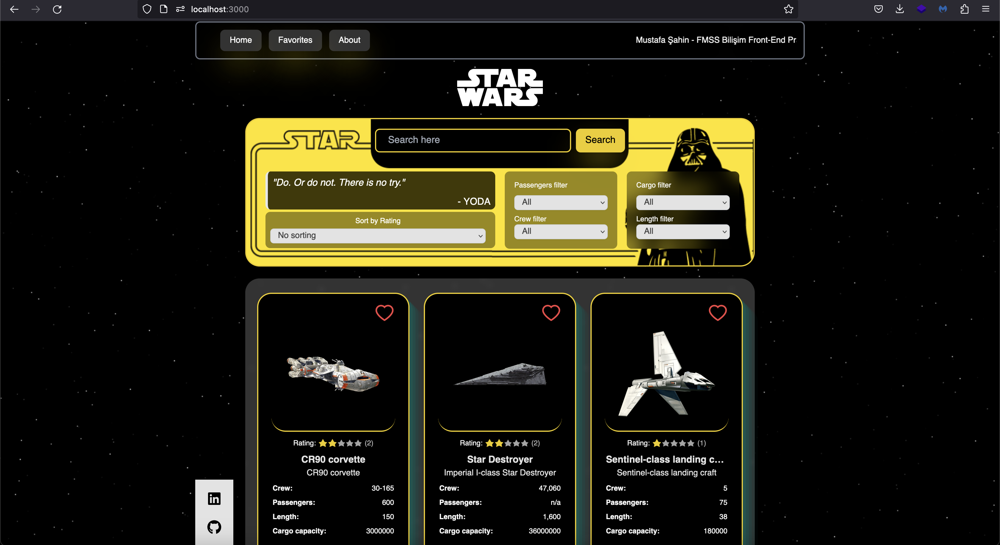
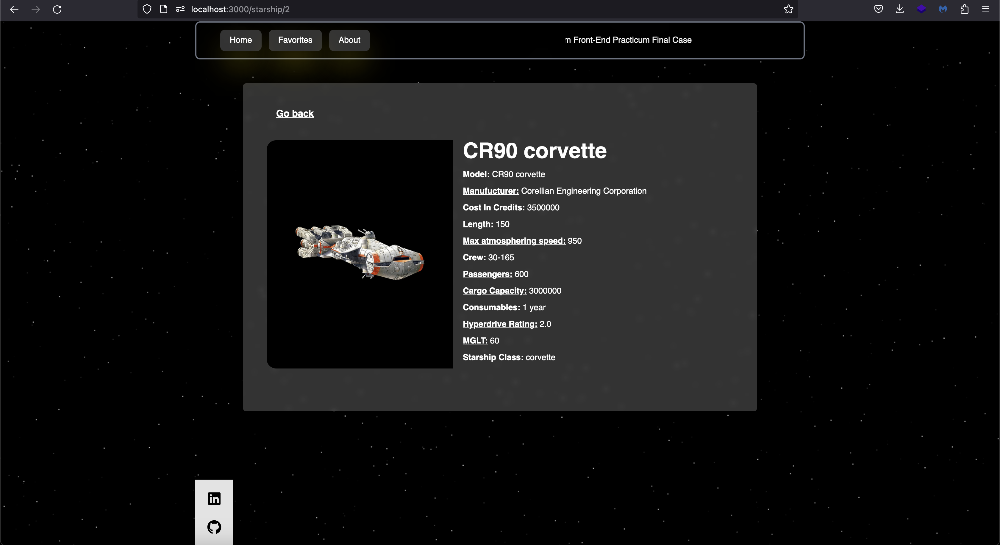
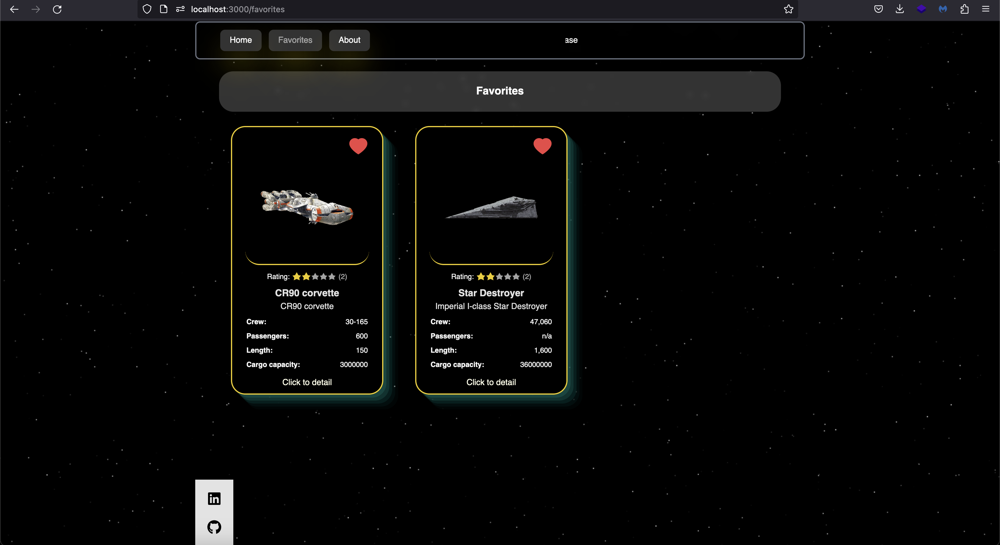
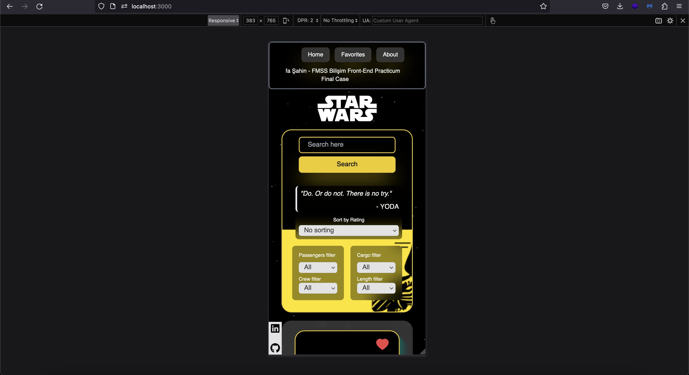
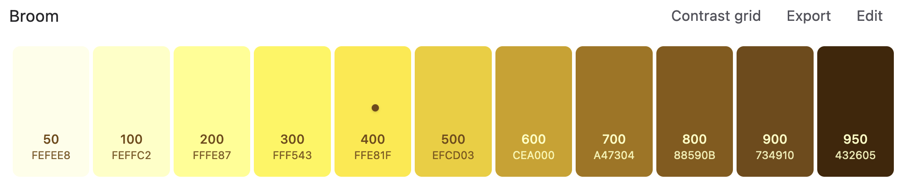
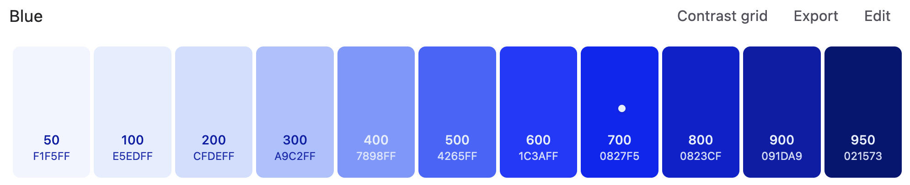
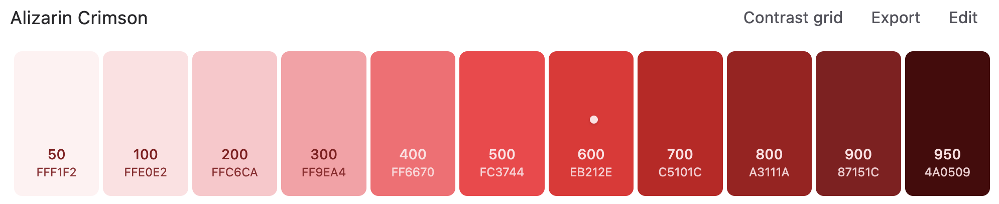
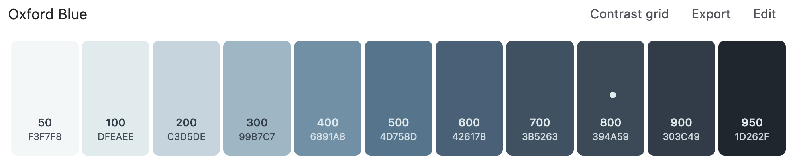
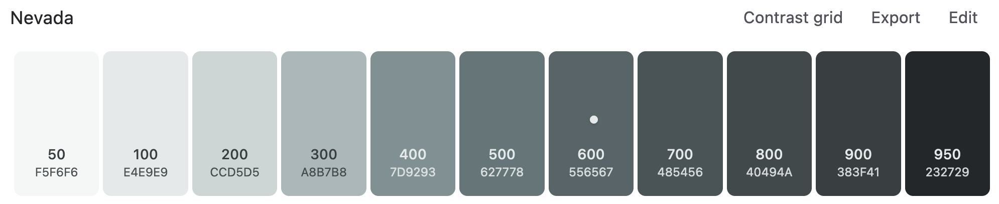
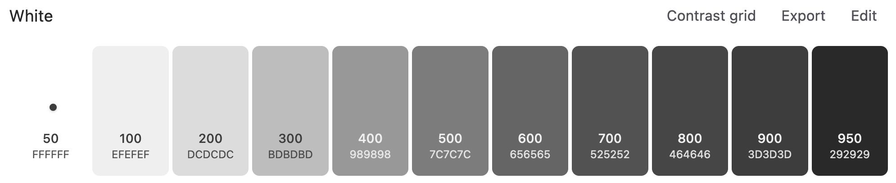

# FMSS PRACTICUM FİNAL CASE 

Modern Star Wars App with React & Tailwind for FMSS Front-End Practicum

**Live Link** => https://fmss-final-case-mustafa-sahin.vercel.app/

# Tecnologies

I preferred **Context** and **React Router Dom** with **React js** instead of **Next or similar** because most of the projects in the market are **old**, I preferred these technologies in this project in order to **adapt to them more easily**.

In my project, I **didn't use any external libraries**. Instead, I tried to create personalized components and try to have an **original design**.

I used ***Helvetica*** and **Helvetica Bold** fonts.

Using Axios and ContextAPI, I retrieved Starships data from the SWAPI, listed the data I fetched. I used React Router Dom to link to the page that displays the details of the starship when it is clicked. While linking, I parsed the last value of the URL from the starship's incoming URL value and sent it with the Link. I caught it with useParams, queried the API again with Axios using the ID and retrieved the details. Since there was no image in the API, I created an image array myself and displayed the image by finding it in the array based on the starship's name when listing and displaying details. I developed a favorite mechanism and stored the starships that were added to favorites in localStorage, and listed them on the favorites page. I tried to design a modern and dynamic interface as much as possible.

# Images

# Color Palette 

# Fonts

    Helvetica
    Helvetica Bold

# How To Run

Install
---

`npm install`

Start
---

`npm run start`

Usage
---

`npm run dev`
